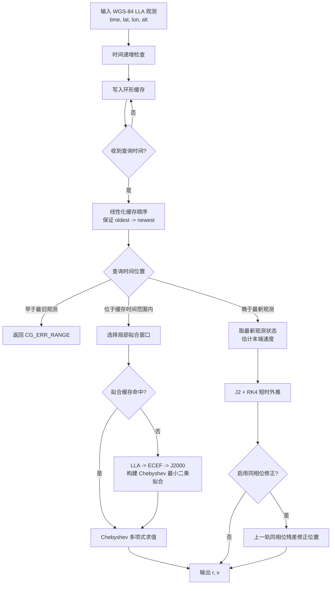

# calgnss_orbit_mini 软件说明

## 1. 软件定位

`calgnss_orbit_mini` 是面向嵌入式和跨平台场景的轻量级 GNSS 轨道状态解算核心库。软件接收按时间递增的 WGS-84 大地坐标观测数据，维护固定容量环形缓存，并根据用户查询时间输出 J2000 惯性坐标系下的位置和速度状态量。

核心文件：

- `include/calgnss_orbit_mini.h`
- `src/calgnss_orbit_mini.c`

该说明仅覆盖核心算法库，不包含示例程序、CSV 导入导出程序或工程测试入口。

## 2. 设计约束

| 项目 | 说明 |
| --- | --- |
| 开发语言 | C 语言，C99 |
| 第三方依赖 | 无第三方运行时依赖，仅使用 C 标准库、`math.h`、`stdint.h`、`stddef.h` 等基础头文件 |
| 跨平台目标 | Windows、Linux、RTOS |
| 平台相关性 | 核心算法不依赖 Windows API、POSIX API、文件系统、线程、动态加载或系统时间函数 |
| 内存目标 | 运行内存尽量控制在 128 KB 以内，缓存长度 `N` 可配置 |
| CPU 目标 | 查询阶段避免高阶轨道力模型，短时外推使用 J2 摄动 + RK4，默认步长 10 s |
| 输入节拍 | 推荐 1 Hz 观测输入，允许不定时长缺测 |
| 查询能力 | 支持观测时间范围内的毫秒级插值；支持未来最多 1 h 短时外推 |

## 3. 输入与输出

### 3.1 输入数据

每组观测数据对应 `cg_observation_t`：

```c
typedef struct cg_observation_t {
    cg_time_t time_utc;
    double lat_deg;
    double lon_deg;
    double alt_m;
} cg_observation_t;
```

输入字段：

| 字段 | 单位 | 说明 |
| --- | --- | --- |
| `time_utc` | UTC | 观测时间，调用方需保证日历时间、儒略日 `jd_utc`、Unix 秒 `unix_seconds` 一致 |
| `lat_deg` | deg | WGS-84 纬度 |
| `lon_deg` | deg | WGS-84 经度 |
| `alt_m` | m | WGS-84 椭球高 |

输入要求：

- 时间必须严格递增。
- 数据可存在缺测，算法按实际缓存中的观测点拟合，不强制补齐。
- 当缓存写满时，新数据覆盖最旧数据。

### 3.2 输出状态量

查询输出对应 `cg_state_t`：

```c
typedef struct cg_state_t {
    cg_time_t time_utc;
    cg_vec3_t r_j2000_m;
    cg_vec3_t v_j2000_mps;
} cg_state_t;
```

输出字段：

| 字段 | 单位 | 说明 |
| --- | --- | --- |
| `time_utc` | UTC | 查询时间 |
| `r_j2000_m` | m | J2000 惯性坐标系位置 `[x, y, z]` |
| `v_j2000_mps` | m/s | J2000 惯性坐标系速度 `[vx, vy, vz]` |

精度目标：

| 场景 | 目标 |
| --- | --- |
| 观测时间范围内插值 | 定位精度 `< 10 m`，测速精度 `< 0.2 m/s` |
| 未来 1 h 内外推 | 定位精度 `< 500 m` |

## 4. 核心 API

| API | 功能 |
| --- | --- |
| `cg_default_options` | 返回默认配置 |
| `cg_context_create` | 创建上下文，绑定外部观测缓存 |
| `cg_context_reset` | 清空上下文历史数据和拟合缓存 |
| `cg_context_destroy` | 释放上下文 |
| `cg_context_push` | 写入一组递增时间的 WGS-84 LLA 观测 |
| `cg_context_query_state` | 按查询时间输出 J2000 状态量 |
| `cg_context_count` | 返回当前缓存观测数量 |
| `cg_context_capacity` | 返回缓存容量 |
| `cg_status_string` | 返回错误码文本说明 |

配置结构 `cg_options_t`：

| 字段 | 默认值 | 说明 |
| --- | ---: | --- |
| `degree` | `10` | Chebyshev 拟合阶数，内部最大值 `CG_MAX_DEGREE = 16` |
| `fit_window_minutes` | `60.0` | 查询时选取的局部拟合窗口长度 |
| `max_extrapolation_seconds` | `0.0` | 外推时间限制，`<= 0` 表示不限制；产品配置建议设为 `3600.0` |
| `extrapolation_history_seconds` | `7200.0` | 外推初始状态拟合最多回看历史秒数，`<= 0` 表示使用全部缓存 |
| `propagation_step_seconds` | `10.0` | J2 RK4 外推步长 |
| `enable_orbit_phase_correction` | `1` | 是否启用上一轨同相位残差修正 |

## 5. 数据处理流程



处理特点：

- 环形缓存只保存最近 `N` 组观测，`N` 由用户提供的外部数组决定。
- 插值查询使用查询时刻附近的局部窗口，不要求查询时刻必须落在原始观测点上。
- 缺测时，窗口内仍使用实际存在的数据点拟合；若有效点不足，返回拟合错误。
- 未来查询使用最近缓存历史拟合出的末端状态进行短时动力学外推，历史跨度由 `extrapolation_history_seconds` 限制。

## 6. 坐标转换

坐标转换流程：

```text
WGS-84 LLA -> WGS-84 ECEF -> J2000/GCRS
```

主要步骤：

1. 根据 WGS-84 椭球参数，将纬度、经度、高度转换为地固系 ECEF 位置。
2. 根据 UTC 时间构造岁差、章动和格林尼治视恒星时模型。
3. 将 ECEF 位置转换到 J2000 惯性坐标系。
4. 对速度输出，插值阶段使用 Chebyshev 位置多项式的解析导数；外推阶段使用动力学积分状态中的速度。

## 7. 插值拟合算法

观测时间范围内的查询使用 Chebyshev 多项式局部最小二乘拟合。

设拟合窗口内时间归一化为：

```text
tau = (t - t_epoch) / t_scale
```

对 J2000 位置分量分别拟合：

```text
x(t) = sum(cx_i * T_i(tau))
y(t) = sum(cy_i * T_i(tau))
z(t) = sum(cz_i * T_i(tau))
```

速度由解析导数得到：

```text
vx = dx/dt
vy = dy/dt
vz = dz/dt
```

实现要点：

- 默认阶数为 10 阶，最大阶数为 16 阶。
- 若窗口内观测点数量小于请求阶数，自动降阶到 `观测点数 - 1`。
- 拟合矩阵使用固定大小栈数组，不随运行时动态申请。
- 上一次拟合窗口会被缓存，连续查询同一窗口时可直接复用拟合系数。

## 8. J2 外推算法

未来查询不是把 Chebyshev 多项式直接延伸到窗口外，因为高阶多项式在拟合窗口外容易发散或振荡。软件使用物理轨道动力学模型进行短时外推。

从最后一个观测历元的状态量开始：

```text
状态 y = [x, y, z, vx, vy, vz]
```

微分方程：

```text
dr/dt = v
dv/dt = a(r)
```

其中加速度由地球中心引力和 J2 摄动组成：

```text
a = -mu * r / |r|^3 + a_J2
```

J2 项：

```text
aJ2_x = 1.5 * J2 * mu * Re^2 / r^5 * x * (5z^2/r^2 - 1)
aJ2_y = 1.5 * J2 * mu * Re^2 / r^5 * y * (5z^2/r^2 - 1)
aJ2_z = 1.5 * J2 * mu * Re^2 / r^5 * z * (5z^2/r^2 - 3)
```

积分方法：

- 使用四阶 Runge-Kutta 积分。
- 默认步长为 10 s。
- 未来 1 h 外推时最多约 360 个 RK4 步。
- 当历史数据覆盖上一轨相位时，可启用同相位残差修正，降低短时外推的系统误差。

## 9. 精度验证结果

验证数据来源：`20260522/calgnss_orbit_mini.xlsx`，对比基准为 STK J2000 状态量。统计单位：位置误差为 m，速度误差为 m/s。

### 9.1 观测范围内插值

统计区间：`2026-05-18 04:00:10` 至 `2026-05-18 04:59:59.750`，步长 0.25 s，共 14360 个有效统计点。

| 指标 | 平均值 | 最大值 |
| --- | ---: | ---: |
| `abs(dx)` | 0.699 m | 1.020 m |
| `abs(dy)` | 0.205 m | 0.313 m |
| `abs(dz)` | 0.884 m | 1.273 m |
| 三维位置误差 `sqrt(dx^2 + dy^2 + dz^2)` | 1.193 m | 1.570 m |
| `abs(dvx)` | 0.011 m/s | 0.082 m/s |
| `abs(dvy)` | 0.011 m/s | 0.086 m/s |
| `abs(dvz)` | 0.007 m/s | 0.058 m/s |
| 三维速度误差 `sqrt(dvx^2 + dvy^2 + dvz^2)` | 0.020 m/s | 0.094 m/s |

结论：插值定位和测速均满足 `定位精度 < 10 m`、`测速精度 < 0.2 m/s` 的目标。

### 9.2 未来 1 h 外推

统计区间：`2026-05-18 05:00:00` 至 `2026-05-18 06:00:00`，步长 0.25 s，共 14401 个有效统计点。

| 指标 | 平均值 | 最大值 |
| --- | ---: | ---: |
| `abs(dx)` | 97.980 m | 247.167 m |
| `abs(dy)` | 76.319 m | 160.663 m |
| `abs(dz)` | 52.907 m | 196.824 m |
| 三维位置误差 `sqrt(dx^2 + dy^2 + dz^2)` | 143.164 m | 314.455 m |
| `abs(dvx)` | 0.064 m/s | 0.143 m/s |
| `abs(dvy)` | 0.082 m/s | 0.262 m/s |
| `abs(dvz)` | 0.079 m/s | 0.174 m/s |
| 三维速度误差 `sqrt(dvx^2 + dvy^2 + dvz^2)` | 0.145 m/s | 0.286 m/s |

结论：1 h 外推三维位置最大误差约 314.455 m，满足 `定位精度 < 500 m` 的目标。

## 10. 内存占用

以下大小基于当前 64 位构建下的结构体布局估算：

| 项目 | 大小 |
| --- | ---: |
| `cg_time_t` | 48 B |
| `cg_vec3_t` | 24 B |
| `cg_state_t` | 96 B |
| `cg_observation_t` | 72 B |
| `cg_options_t` | 40 B |
| `cg_fit_t` | 448 B |
| `cg_fit_cache_t` | 472 B |
| `cg_context_t` | 1016 B |
| 默认 10 组观测缓存 | 720 B |
| 默认上下文 + 默认观测缓存 | 1736 B |
| Chebyshev 拟合主要栈数组峰值 | 约 5440 B |

运行内存估算：

```text
RAM_peak ~= sizeof(cg_context_t) + N * sizeof(cg_observation_t) + stack_peak
         ~= 1016 + 72N + 5440 bytes
```

128 KB 内存预算下的缓存容量建议：

| 缓存容量 N | 观测缓存 | 估算峰值 RAM |
| ---: | ---: | ---: |
| 10 | 720 B | 约 7.0 KB |
| 600 | 43.2 KB | 约 49.7 KB |
| 1200 | 86.4 KB | 约 92.9 KB |
| 1600 | 115.2 KB | 约 121.7 KB |

注意：

- 如果按 1 Hz 完整缓存 1 h 数据，`N = 3601`，仅观测缓存约 253.2 KB，超过 128 KB。
- 在 128 KB 约束下，推荐根据实际精度需求配置较小的 `N` 和 `fit_window_minutes`。
- 若必须同时满足 1 h 原始观测全量缓存和 128 KB 内存上限，需要进一步压缩观测结构，例如压缩时间字段、使用定点或差分编码、外部存储历史数据。

## 11. 计算资源占用

| 操作 | 计算复杂度 | 说明 |
| --- | --- | --- |
| 写入观测 `cg_context_push` | `O(1)` | 环形缓存写入，仅做时间递增检查和结构体复制 |
| 观测范围内查询，拟合缓存命中 | `O(degree)` | 仅进行 Chebyshev 位置和导数求值 |
| 观测范围内查询，拟合缓存未命中 | `O(M * degree^2 + degree^3)` | `M` 为窗口内观测点数，包含坐标转换、法方程构建和线性方程求解 |
| 未来外推 | `O(horizon / step)` | 默认 1 h、10 s 步长约 360 个 RK4 步，每步 4 次加速度计算 |
| 同相位修正 | 额外一次历史状态查找、一次短弧段传播和一次插值 | 用于降低短时外推系统误差 |

CPU 负载主要来自：

1. ECEF 到 J2000 转换中的三角函数和 IAU 2000B 章动项计算。
2. Chebyshev 拟合缓存未命中时，对窗口内全部观测进行坐标转换和矩阵累积。
3. 未来外推时 RK4 循环中的 `sqrt`、`pow` 和向量运算。

嵌入式配置建议：

- 若查询频率高，尽量复用同一拟合窗口，减少拟合缓存失效。
- RTOS 或低主频 MCU 上建议降低 `degree`、`fit_window_minutes` 和 `N`。
- 若只需要 1 Hz 查询，可优先保证拟合窗口稳定；若需要毫秒级高频查询，应避免每次查询都触发重新拟合。
- 对 1 h 外推，默认 10 s 步长可满足当前验证精度；若 CPU 资源紧张，可适当增大步长并重新验证外推误差。

## 12. 错误处理

| 错误码 | 含义 |
| --- | --- |
| `CG_OK` | 成功 |
| `CG_ERR_INVALID_ARGUMENT` | 输入参数无效，或缓存观测不足 |
| `CG_ERR_PARSE` | 解析错误，核心库当前不直接解析文本 |
| `CG_ERR_IO` | I/O 错误，核心库当前不直接访问文件 |
| `CG_ERR_NO_MEMORY` | 上下文动态分配失败 |
| `CG_ERR_RANGE` | 查询时间不在支持范围内，或外推超过配置限制 |
| `CG_ERR_FIT` | 拟合失败，通常由观测点不足、时间跨度为零或矩阵病态导致 |

## 13. 当前限制与后续优化方向

当前限制：

- 上下文对象使用 `malloc/free` 管理；若 RTOS 禁止动态内存，可增加静态上下文初始化接口。
- `cg_time_t` 同时保存日历字段、儒略日和 Unix 秒，易用性较好，但单条观测占用较大。
- 1 h 原始 1 Hz 观测全量缓存会超过 128 KB 内存预算。
- 当前 UTC 到 TT 使用固定常数，若跨越闰秒维护周期，需要同步更新。

后续优化方向：

- 增加无动态内存版本的 `cg_context_init_static`。
- 将观测缓存改为压缩结构，例如基准时间 + 相对毫秒、经纬高定点量化。
- 对窗口选择使用增量索引或二分查找，降低大缓存下的窗口搜索开销。
- 将坐标转换结果预计算到缓存，减少高频查询时的三角函数开销。
- 为不同平台增加资源配置表，例如 PC、ARM Cortex-M、RTOS 静态内存模式。
